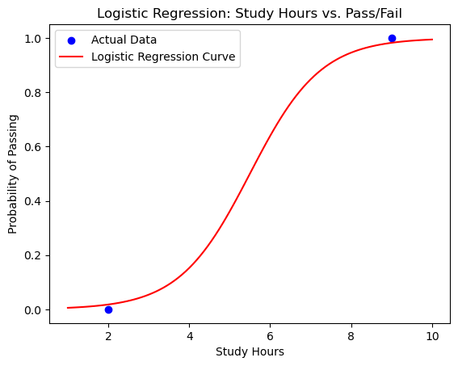

```python
pip install numpy pandas scikit-learn matplotlib
```

    Requirement already satisfied: numpy in /opt/anaconda3/lib/python3.13/site-packages (2.1.3)
    Requirement already satisfied: pandas in /opt/anaconda3/lib/python3.13/site-packages (2.2.3)
    Requirement already satisfied: scikit-learn in /opt/anaconda3/lib/python3.13/site-packages (1.6.1)
    Requirement already satisfied: matplotlib in /opt/anaconda3/lib/python3.13/site-packages (3.10.0)
    Requirement already satisfied: python-dateutil>=2.8.2 in /opt/anaconda3/lib/python3.13/site-packages (from pandas) (2.9.0.post0)
    Requirement already satisfied: pytz>=2020.1 in /opt/anaconda3/lib/python3.13/site-packages (from pandas) (2024.1)
    Requirement already satisfied: tzdata>=2022.7 in /opt/anaconda3/lib/python3.13/site-packages (from pandas) (2025.2)
    Requirement already satisfied: scipy>=1.6.0 in /opt/anaconda3/lib/python3.13/site-packages (from scikit-learn) (1.15.3)
    Requirement already satisfied: joblib>=1.2.0 in /opt/anaconda3/lib/python3.13/site-packages (from scikit-learn) (1.4.2)
    Requirement already satisfied: threadpoolctl>=3.1.0 in /opt/anaconda3/lib/python3.13/site-packages (from scikit-learn) (3.5.0)
    Requirement already satisfied: contourpy>=1.0.1 in /opt/anaconda3/lib/python3.13/site-packages (from matplotlib) (1.3.1)
    Requirement already satisfied: cycler>=0.10 in /opt/anaconda3/lib/python3.13/site-packages (from matplotlib) (0.11.0)
    Requirement already satisfied: fonttools>=4.22.0 in /opt/anaconda3/lib/python3.13/site-packages (from matplotlib) (4.55.3)
    Requirement already satisfied: kiwisolver>=1.3.1 in /opt/anaconda3/lib/python3.13/site-packages (from matplotlib) (1.4.8)
    Requirement already satisfied: packaging>=20.0 in /opt/anaconda3/lib/python3.13/site-packages (from matplotlib) (24.2)
    Requirement already satisfied: pillow>=8 in /opt/anaconda3/lib/python3.13/site-packages (from matplotlib) (11.1.0)
    Requirement already satisfied: pyparsing>=2.3.1 in /opt/anaconda3/lib/python3.13/site-packages (from matplotlib) (3.2.0)
    Requirement already satisfied: six>=1.5 in /opt/anaconda3/lib/python3.13/site-packages (from python-dateutil>=2.8.2->pandas) (1.17.0)
    Note: you may need to restart the kernel to use updated packages.


```python
# Import necessary libraries
import numpy as np
import pandas as pd
from sklearn.model_selection import train_test_split
from sklearn.linear_model import LogisticRegression
from sklearn.metrics import accuracy_score, confusion_matrix, classification_report
import matplotlib.pyplot as plt
```


```python
# Sample dataset: Study hours and whether students passed or failed
data = {
    'StudyHours': [1, 2, 3, 4, 5, 6, 7, 8, 9, 10],
    'Pass': [0, 0, 0, 0, 0, 1, 1, 1, 1, 1]  # 0 = Fail, 1 = Pass
}

# Convert to DataFrame
df = pd.DataFrame(data)

# Display the first few rows of the data
print(df.head())
```

       StudyHours  Pass
    0           1     0
    1           2     0
    2           3     0
    3           4     0
    4           5     0


```python
# Features (X) and Target (y)
X = df[['StudyHours']]  # Feature(s)
y = df['Pass']          # Target variable (0 = Fail, 1 = Pass)

# Split data into 80% training and 20% testing
X_train, X_test, y_train, y_test = train_test_split(X, y, test_size=0.2, random_state=42)

# Display the shape of the training and testing sets
print(f"Training data: {X_train.shape}, {y_train.shape}")
print(f"Testing data: {X_test.shape}, {y_test.shape}")
```

    Training data: (8, 1), (8,)
    Testing data: (2, 1), (2,)


```python
# Initialize the Logistic Regression model
model = LogisticRegression()

# Train the model on the training data
model.fit(X_train, y_train)

# Display the model's learned coefficients
print(f"Intercept: {model.intercept_}")
print(f"Coefficient: {model.coef_[0]}")
```

    Intercept: [-6.28495636]
    Coefficient: [1.14270903]


```python
# Make predictions on the testing set
y_pred = model.predict(X_test)

# Display the predictions
print("Predicted Outcomes (Pass/Fail):", y_pred)
print("Actual Outcomes:", y_test.values)
```

    Predicted Outcomes (Pass/Fail): [1 0]
    Actual Outcomes: [1 0]


```python
# Calculate accuracy
accuracy = accuracy_score(y_test, y_pred)

# Generate confusion matrix
conf_matrix = confusion_matrix(y_test, y_pred)

# Generate classification report
class_report = classification_report(y_test, y_pred)

# Display evaluation metrics
print(f"Accuracy: {accuracy}")
print("Confusion Matrix:")
print(conf_matrix)
print("Classification Report:")
print(class_report)
```

    Accuracy: 1.0
    Confusion Matrix:
    [[1 0]
     [0 1]]
    Classification Report:
                  precision    recall  f1-score   support
    
               0       1.00      1.00      1.00         1
               1       1.00      1.00      1.00         1
    
        accuracy                           1.00         2
       macro avg       1.00      1.00      1.00         2
    weighted avg       1.00      1.00      1.00         2
    


```python
# Create a range of study hours for plotting
study_hours_range = np.linspace(X.min(), X.max(), 100)

# Calculate predicted probabilities using the sigmoid function
y_prob = model.predict_proba(study_hours_range.reshape(-1, 1))[:, 1]

# Plot the actual data points
plt.scatter(X_test, y_test, color='blue', label='Actual Data')

# Plot the logistic regression curve
plt.plot(study_hours_range, y_prob, color='red', label='Logistic Regression Curve')

# Add labels and title
plt.xlabel('Study Hours')
plt.ylabel('Probability of Passing')
plt.title('Logistic Regression: Study Hours vs. Pass/Fail')
plt.legend()

# Show the plot
plt.show()
```

    /opt/anaconda3/lib/python3.13/site-packages/sklearn/utils/validation.py:2739: UserWarning: X does not have valid feature names, but LogisticRegression was fitted with feature names
      warnings.warn(


    

    


```python

```
